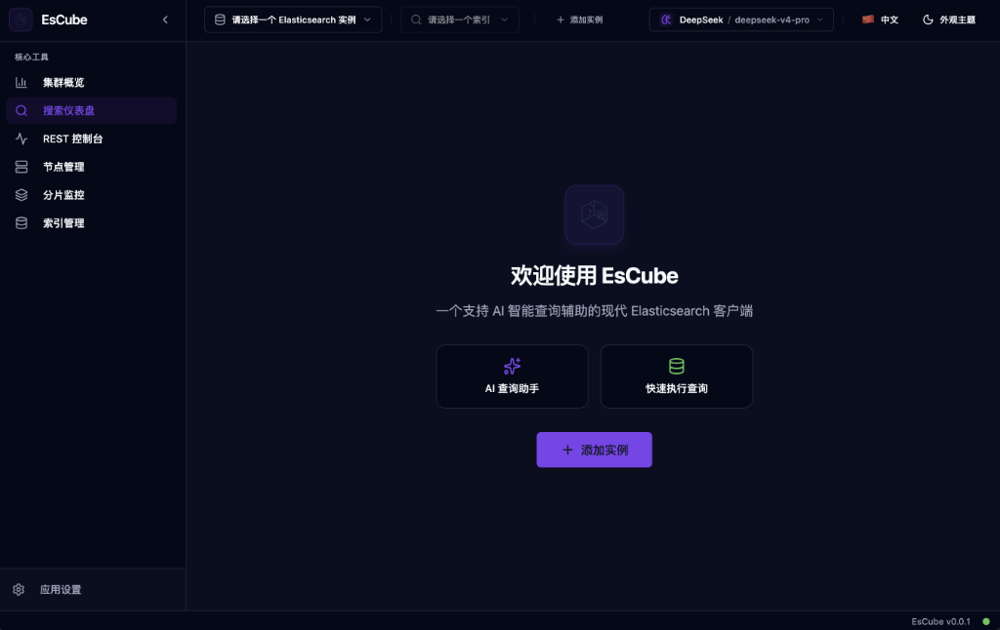

# EsCube

一个现代化的 Elasticsearch 客户端，具备 AI 驱动的查询辅助功能，基于 Electron、React 和 TypeScript 构建。



## 🚀 功能特性

- **多实例管理**: 同时连接多个 Elasticsearch 集群
- **版本自动检测**: 自动检测并适配 ES 7.x/8.x 版本
- **AI 查询助手**: 使用 LLM 将自然语言转换为 Elasticsearch DSL
- **安全凭证存储**: 使用 Electron 的 `safeStorage` 加密敏感数据
- **集群管理工具**: 内置 REST 控制台、仪表盘、集群健康度、节点管理、分片监控和索引管理
- **主题切换**: 支持系统主题检测和手动切换深色/浅色模式
- **多语言支持**: 支持英语和简体中文本地化
- **危险操作检测**: 在执行潜在破坏性查询前警告用户
- **Monaco 编辑器**: 支持 ES DSL 语法的全功能代码编辑器

## 🛠 技术栈

- **核心**: [Electron](https://www.electronjs.org/) + [React](https://react.dev/) + [TypeScript](https://www.typescriptlang.org/)
- **构建工具**: [Vite](https://vitejs.dev/) + [pnpm](https://pnpm.io/)
- **UI 组件**: [shadcn/ui](https://ui.shadcn.com/) + [Radix UI](https://www.radix-ui.com/) + [Tailwind CSS](https://tailwindcss.com/)
- **状态管理**: [Zustand](https://docs.pmnd.rs/zustand/)
- **代码编辑器**: [Monaco Editor](https://microsoft.github.io/monaco-editor/)
- **存储**: `electron-store` & `safeStorage`

## 📂 项目结构

```text
es-cube/
├── packages/
│   ├── main/           # Electron 主进程 (业务逻辑与安全存储)
│   ├── preload/        # 预加载脚本 (IPC 安全桥接)
│   ├── renderer/       # React 渲染进程 (UI 应用)
│   └── shared/         # 共享类型定义
├── dist/               # 构建输出目录
├── build/              # 安装包打包输出 (DMG, EXE, etc.)
└── resources/          # 应用图标与资源文件
```

## 📦 开发与构建

### 环境要求

- Node.js 20+
- pnpm 8+

### 快速开始

```bash
# 安装依赖
pnpm install

# 启动开发模式
pnpm dev
```

### 构建应用

```bash
# 构建并为当前平台打包
pnpm package

# 为特定平台打包
pnpm package:mac   # macOS
pnpm package:win   # Windows
pnpm package:linux # Linux
```

## 🔐 安全性

- **凭证加密**: 所有的 Elasticsearch 登录凭证通过 `safeStorage` 进行硬件级别的加密存储。
- **查询确认**: 涉及 `DELETE` 或 `UPDATE` 等破坏性操作时，系统会强制弹出确认对话框。
- **AI 隔离**: AI 生成的代码仅作为输入建议插入编辑器，除非用户手动触发，否则不会直接执行。

## 📄 许可证

[MIT](LICENSE) © UNXAI Team
